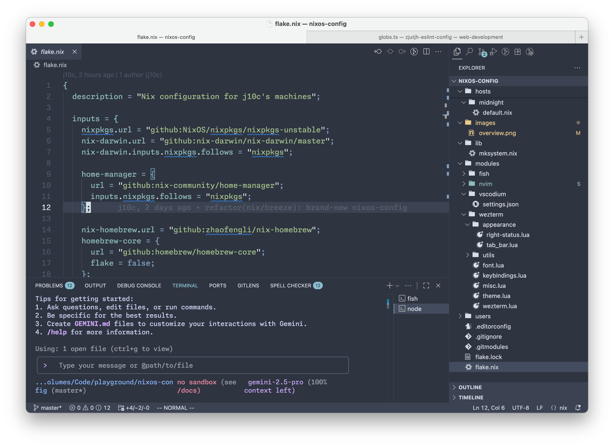

## j10c's Nix Configuration

My configuration for macOS (via nix-darwin) ~~and NixOS(maybe in future)~~, managed with [Nix Flakes](https://nixos.wiki/wiki/Flakes).



### Philosophy

One configuration, cross-platform compatibility. By leveraging the power of Nix, this setup shares as much configuration as possible between multiple machines to ensure a consistent development environment.

### Structure

The repository is structured as follows:

- `flake.nix`: The main entry point for the Flake, defining all inputs and outputs.
- `hosts/`: Contains per-host specific configurations.
- `modules/`: Shared modules that can be used across different hosts (e.g., nvim, fish, wezterm).
- `users/`: User-specific configurations managed by [home-manager](https://github.com/nix-community/home-manager).
- `lib/`: Helper functions used for building the systems.

### Deployment

```shell
# Switch to the configuration for a specific host
sudo darwin-rebuild switch --flake .#Breeze
```

### Preferences

Here are my personal environment preferences:

| Item         | Name                 |
| ------------ | -------------------- |
| Font         | Monaspace Neon(cv11) |
| Color Scheme | Nord                 |
| Keybinding   | Vim like(hjkl)       |
