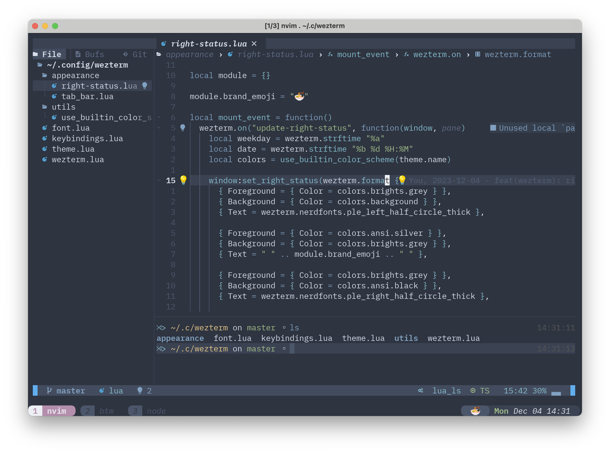

# j10c's dotfiles

Dotfiles for my cli workflow, includes nvim, wezterm configuration.

> [!NOTE]
> My nvim configuration is based on AstroNvim, see myself part and
> installation in [astronvim-config](https://github.com/j10ccc/astronvim-config)

## Preview



## Principle

One configuration, gets compatible with two OSes, macOS and Linux(NixOS).

Those app, especially WezTerm 👍, using lua to generate their config help
me a lot in cross-platform.

## Preference

I list a tabel of my preference in those configurations. 🤩

| Things       | Name                |
| ------------ | ------------------- |
| Font         | Blex Mono Nerd Font |
| Color Scheme | Nord                |
| Keybinding   | Vim like(hjkl)      |

## Installation

** Make a backup of your current `.config` **

```shell
mv ~/.config ~/.config.bak
```

** Clone this repo **

```shell
git clone --depth 1 https://github.com/j10ccc/dotfiles.git ~/.config
```
